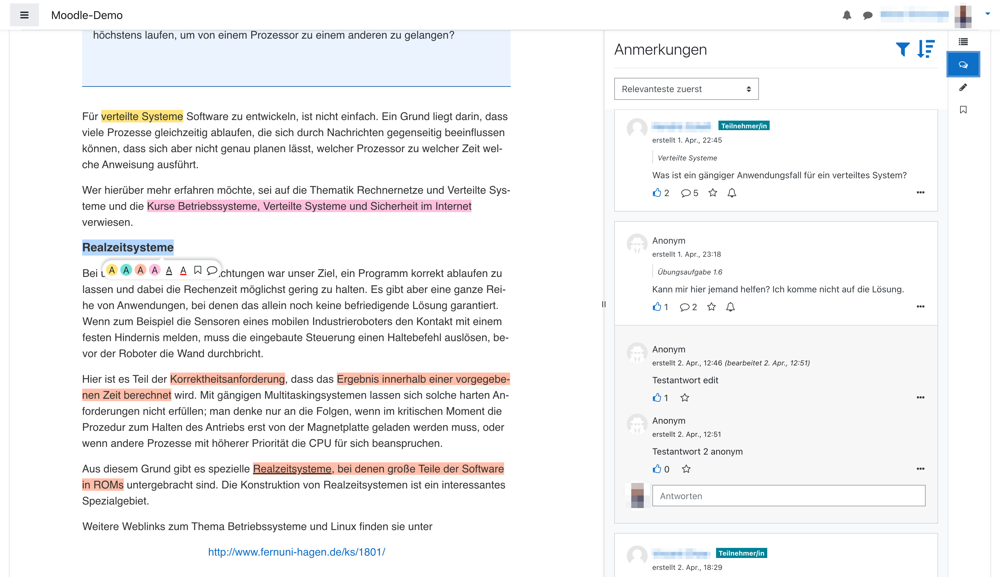

# mod-longpage



_Longpage_ or _mod-longpage_ is a [Moodle (Activity) plugin](https://docs.moodle.org/dev/Activity_modules) for providing long and structured texts in HTML for courses paired up with functions to navigate, annotate and co-read the text with other users. It is based on the [Page](https://docs.moodle.org/310/en/Page_resource) or [mod_longpage module](https://docs.moodle.org/310/en/Page_resource) which is part of the standard installation of Moodle. _Page_ by itself simply allows for providing texts included in a Moodle page with no further functionality attached. _Longpage_ can be seen as an extension of _Page_ with is to be used as a replacement of _Page_ for providing users with extra functionality. The main features _Longpage_ adds on top of _Page_ are:

**Enhanced Reading Experience**

- _Reading-friendly design_ optimized for long-form content
- _Automatic reading time prediction_ for chapters and sections
- _Auto-save scroll position_ to continue reading where you left off
- _Interactive table of contents_ showing current position and section navigation
- _Mobile-responsive interface_ for reading on any device

**Annotation & Highlighting**

- _Multi-color highlighting_ in four different colors
- _Text underlining_ in red or black
- _Bookmark functionality_ for text selections with quick jump-back
- _Rich note-taking_ with mathematical formulas (TeX notation support)
- _Persistent annotations_ saved across sessions

**Collaboration & Social Features**

- _Public note sharing_ with anonymous options
- _Thread-based discussions_ starting from shared notes
- _Notification subscriptions_ for thread updates and new posts
- _Question-answer functionality_ for peer learning
- _Community-driven content interaction_

**Discussion Management**

- _Like/rating system_ for community notes
- _Read/unread status tracking_ for posts and notes
- _Advanced filtering options_ by content, author, likes, status, and timestamps
- _Flexible sorting_ by time, position, relevance, and reading progress

**Analytics & Intelligence**

- _Reading progress tracking_ based on scroll behavior
- _Collaborative filtering_ for post content recommendations
- _Relevance-based sorting_

**Educational Integration**

- _Embedded reading comprehension questions_ with interactive sidebar
- _Progress reporting_ and assessment tools
- _Course-wide analytics_ for instructors
- _Integration with Moodle gradebook_ and completion tracking

## Installation

Before you can install the plugin you should have a proper Moodle installation running. See [here](https://docs.moodle.org/310/en/Installing_Moodle) for a tutorial on how to install Moodle. Pay special attention to enabling [Cron](https://docs.moodle.org/310/en/Cron) since it is necessary for some functionality of the Longpage plugin (notifications on activity of other users, calculation of relevance of annotations/threads/posts for a user). The plugin has been developed with Moodle version 4.5 but it has also been tested with older version between 3.5 and 4.1 so it should work with them as well. 

On installing the plugin itself:

1. Clone this repository and rename the folder to `longpage`.

2. To uninstall the _Page_ plugin probably already installed, go to the folder your Moodle installation is located in and run

```shell
php admin/cli/uninstall_plugins.php --plugins=mod_longpage --run
```

3. To install the _Longpage_ plugin afterwards, copy the repository downloaded in the 1. step into the `mod` folder in the folder your Moodle installation is located in replacing the current `mod/longpage` folder containing the regular _Page_ plugin. Now, login to your Moodle running as an administrator. The install/update GUI should open automatically. Just follow the steps the GUI presents to you and you should have installed the _Longpage_ plugin successfully afterwards. As an alternative to using the GUI for installation, you can also run the update script from within the folder of your Moodle installation:

```shell
php admin/cli/upgrade.php
```

## Usage

You use the _Longpage_ plugin exacly like as you would use the regular _Page_ plugin since _Longapge_ is simply the _Page_ plugin with some functionality added on top. If you don't yet know how to use the _Page_ plugin, have a look into the [official Moodle documentation](https://docs.moodle.org/310/en/Page_resource).

### Embedding Reading Comprehension Questions

In order to use embedded reading comprehension questions, you will need to install the ["Embed questions filter"](https://moodle.org/plugins/filter_embedquestion), ["Embed question atto button"](https://moodle.org/plugins/atto_embedquestion) and ["Embedded questions progress"](https://moodle.org/plugins/report_embedquestion) Moodle plugins. Documentation on how to embed questions with the plugin can be found [here](https://github.com/moodleou/moodle-filter_embedquestion/blob/main/internaldoc/functionality.txt).

Basically, with these plugins, you have to add a cryptic code for each question at the location in the text in the longpage content where the question should appear in the sidebar when scrolling over the text.

You will also need to enable the reading comprehension feature in the settings.

## Troubleshooting

- remove, install or reinstall node_modules (npm install)
- moodle: purge caches and disable caching (use search: 'cache' on moodle site administration)
- If there is a javascript error that app-lazy.js could not be loaded, try to create a symbolic link from app-lazy.min.js to app-lazy.js. For Windows users:

```shell
mklink mod\longpage\amd\src\app-lazy.min.js mod\longpage\amd\build\app-lazy.min.js
```

## Testing

Run PHPUnit tests from the Moodle root directory:

```shell
vendor/bin/phpunit --testsuite "mod_longpage_testsuite"
```

tba. Vue.js testing

Run code style checks from the Moodle root directory (uses Moodle's phpcs with the moodle coding standard):

```shell
vendor/bin/phpcs -d memory_limit=1024M --standard=moodle --extensions=php mod/longpage
vendor/bin/phpcbf -d memory_limit=1024M --standard=moodle --extensions=php mod/longpage  # auto-fix
```

## Contributing

To contribute to the plugin you should study the [Moodle documentation on plugin development](https://docs.moodle.org/dev/Main_Page) deeply. The plugin is very similar to a regular [Activity plugin](https://docs.moodle.org/dev/Activity_modules). The main difference regards the client or asynchronous javascript modules (AMD) (`amd` directory). Instead of creating javascript files inside `amd` in [require.js](https://requirejs.org/) format from scratch, working with [Grunt](https://gruntjs.com/) etc., the main part of the client which is a [SPA](https://en.wikipedia.org/wiki/Single-page_application) for reading, annotating and navigating the text, is developed with [Vue.js v3](https://v3.vuejs.org/). The files are located inside the `vue` directory which is where you mainly develop the client like you would develop a regular SPA with Vue.js. Sadly, you do not have hot reload like you are maybe used to from other projects with Vue.js. Instead you run

```shell
npm run watch
```

inside the `vue` directory. From then on [Webpack](https://webpack.js.org/), the bundler used for this project, is going to watch all the files in `vue` and its direct and indirect subdirectories. Whenever a file changes, a new (developmental) version of `amd/build/app-lazy.min.js` which is the bundle that contains all html, css and javascript of the SPA. You then have to reload the page inside the browser if you are currently on it to view changes you made to the SPA.

When deploying to production, you run

```shell
npm run build
```

to let Webpack bundle up a production ready version of the plugin. IMPORTANT: Do not use `npm run watch` to build for production since it lacks some optimizations that Webpack applies, i.e. in order to make the bundle smaller in size.

## Credits

This software uses the following open source packages:
[vue.js](https://vuejs.org/),
[vuex](https://vuex.vuejs.org/),
[vue-router](https://router.vuejs.org/),

## Related Moodle Plugins

- [mod_page](https://github.com/moodle/moodle/tree/master/mod/page) - Moodle core plugin
- [mod_pdfannotator](https://moodle.org/plugins/mod_pdfannotator) - Moodle plugin for presenting and annotating PDF files.

## Citation

**Cite this software:**

```
@misc{Seidel2024-MoodleLongpage,
	title = {Longpage - {A} {Moodle} activity plugin designed to assist learners with reading extended texts.},
	url = {https://github.com/CATALPAresearch/mod_longpage},
	doi = {10.17605/OSF.IO/VBCTW},
	author = {Seidel, Niels and Stritzinger, Adrian and Menze, Dennis and Friedrich, Konstantin},
	year = {2024},
	keywords = {P-APLE-II, software},
}
```

## Research articles and datasets about Longpage

**Peer-reviewed papers**

- Menze, D., Seidel, N., & Radović, S. (2025). Dynamic Reading Comprehension Visualization in Digital Course Texts. Proceedings of the 17th International Conference on Computer Supported Education - Volume 1: CSEDU, 266–273. https://doi.org/10.5220/0013216100003932
- Seidel, N., Stritzinger, A., Menze, D., & Friedrich, K. (2024). Longpage - A Moodle activity plugin designed to assist learners with reading extended texts. https://doi.org/10.17605/OSF.IO/VBCTW
- Seidel, N., & Menze, D. (2024). Von der Analyse zur adaptiven Unterstützung beim Lesen. Informatik Spektrum, 47(2), in print. https://doi.org/10.1007/s00287-024-01572-0
- Seidel, N., Dürhager, R., Goldammer, M., Henze, A., Langenbrink, F., Otto, J., & Stirling, V. (2023). Shared listening experience for hyperaudio textbooks. DELFI 2023 – Die 212 Fachtagung Bildungstec Hnologien Der Gesellschaft Für Informatik e.V., 123–128. https://doi.org/10.18420/delfi2023-21
- Menze, D. (2022). Support for Reading Comprehension in Digital Course Texts. FernUniversität in Hagen.
  Menze, D., Seidel, N., & Kasakowskij, R. (2022). Interaction of reading and assessment behavior. In P. A. Henning, M. Striewe, & M. Wölfel (Eds.), DELFI 2022 – Die 21. Fachtagung Bildungstechnologien der Gesellschaft für Informatik e.V. (pp. 27–38). Gesellschaft für Informatik. https://doi.org/10.18420/delfi2022-011
- Seidel, N., & Menze, D. (2022). Interactions of reading and assessment activities. In S. Sosnovsky, P. Brusilovsky, & A. Lan (Eds.), 4th Workshop on Intelligent Textbooks, 2022 (pp. 64–76). CEUR-WS. http://ceur-ws.org/Vol-3192/

**Datasets/Software:**

- Seidel, N., Stritzinger, A., Menze, D., & Friedrich, K. (2024). Longpage - A Moodle activity plugin designed to assist learners with reading extended texts. https://doi.org/10.17605/OSF.IO/VBCTW
- Seidel, N., & Menze, D. (2022). Data and Analysis of Reading and Assessment Activities in Moodle. Zenodo. https://doi.org/10.5281/zenodo.7300070

## You may also like ...

- [format_serial3](https//github.com/catalparesearch/format_serial3) - Learning Analytics Dashboard for Moodle Courses
- [mod_usenet](https//github.com/catalparesearch/mod_usenet) - Usenet client for Moodle
- [local_ari](https//github.com/catalparesearch/local_ari) - Adaptation Rule Interface
- [mod_hypercast](https://github.com/nise/mod_hypercast) - Hyperaudio player for course texts supporting audio cues, text2speech conversion, text comments, and collaborative listining experiences

## Contributors

- Niels Seidel (project lead)
- Adrian Stritzinger
- Dennis Menze
- Konstantin Friedrich

## Licence

[GNU GPL v3 or later](http://www.gnu.org/copyleft/gpl.html)
